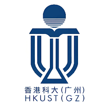
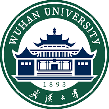

## Biography

Hi! I am a third-year PhD student at the sustainable energy and environment thrust of The Hong Kong University of Science and Technology (Guangzhou) under the supervision of [Prof. Tong-Yi Zhang](https://facultyprofiles.hkust-gz.edu.cn/faculty-personal-page/ZHANG-Tongyi/mezhangt), [Prof. Jiaqiang Huang](https://seejhuang.people.ust.hk/), and [Prof. Jia Li](https://sites.google.com/view/lijia). Previously, I obtained my B.Eng in computer science and technology from Wuhan University in 2022. 

My current research interest lies in AI for batteries, especially domain-knowledge-guided AI and interpretable AI for batteries. More details can be found in my [google scholar](https://scholar.google.com/citations?hl=zh-CN&view_op=list_works&gmla=AC6lMd8PIH28jI9lFlL_C9WwIrKkPBVFLJ4Q4yxwypYTF9x3S1TySXmdp1jXnovKUUB0Hef-DqMoRood9idOPGrsI-ZUPl0&user=XAGG2pIAAAAJ).

## News
- [January 2025] I will start my vising at HKUST from Feb. 1st to Aug. 31st.
- [January 2025] One paper accepted by ICLR (Top-tier AI conference).
- [December 2024] One paper was accepted and selected as a cover paper by ACS Energy Letters (SCI Q1 Top).
- [August 2024] One paper accepted by Energy Storage Materials (SCI Q1 Top).
- [September 2022] I joined HKUST(GZ) as a PhD student in SEE thrust!
- [April 2022] One paper accepted by IJCNN 2022.

## Publications
\* denotes equal contribution

- **SimXRD-4M: Big Simulated X-ray Diffraction Data and Crystalline Symmetry Classification Benchmark**, Bin Cao, Yang Liu, Zinan Zheng, Ruifeng Tan, Jia Li, Tong-Yi Zhang. *To appear in International Conference on Learning Representations (ICLR), 2025.*

* **Forecasting battery degradation trajectory under domain shift with domain generalization**, Ruifeng Tan, Xibin Lu, Minhao Cheng, Jia Li, Jiaqiang Huang, Tong-Yi Zhang. *Energy Storage Materials, 72, 103725, 2024*.
* **Unravelling Thermal and Enthalpy Evolutions of Commercial Sodium-Ion Cells upon Cycling Ageing via Fiber Optic Sensors**, Jiaqiang Huang, Charles Delacourt, Parth Desai, Charlotte Gervillié-Mouravieff, Laura Albero Blanquer, Ruifeng Tan, Jean-Marie Tarascon. *J. Electrochem. Soc. 170 090510, 2023*.
* **PMGNN: A Pioneer-Master Graph Neural Network for Graph Classification**, Ruifeng Tan, and Yuanyuan Zhu. *IJCNN, 2022*.

## Experience

- **PhD Student**    
  SEE Thrust, The Hong Kong University of Science and Technology (Guangzhou) 
  September 2022 - Present    
  Advisor: Tong-Yi Zhang, Jiaqiang Huang, and Jia Li

- **Undergraduate Student**    
  Computer Science and Technology, Wuhan University (WHU) 
  August 2018 - July 2022    
  Advisor: Yuanyuan Zhu

## Selected Awards

- National second prize of software cup 2020 (Top 3%) 

